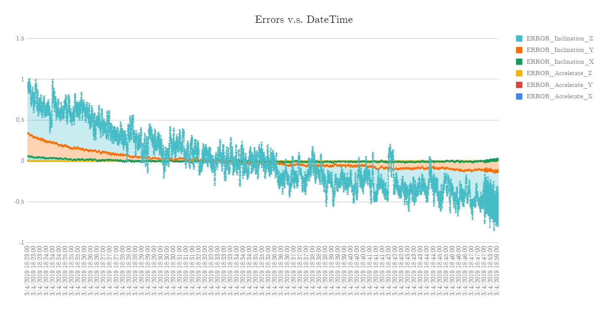

# 倾角仪误差分析

## 误差原因

- 程序在运行一段时间之后，积累了大量的数据，使运行速率下降，**数据采样率下降**，**因此数据间经历的时间不同**，**产生严重的累计误差**。


> 上图为一次 30 min 的测量，横坐标是分钟电脑计算出的数据，纵坐标是时间。程序设定每 20 ms 采集一次数据；即 1 min 采集 3000 次数据。可以看出在 **开始时** 和 **运行一段时间后** 每秒采集的数据是 **不一样** 的，并且都没达到设定值。而程序设置数据间的时间是定值，从而造成了积分上的严重误差。
>
> 这个应该是最严重的问题，不过也很容易解决。

- 倾角仪确实测量不是很准确。。。

  我将传感器静止放置在桌面上，得到加速度和倾角信息。可以发现，Z 轴倾角 和 Y轴倾角 的变动很明显不符合随机误差的统计特性



> 由于涉及到去除重力，这个值的偏差对所有输出值都有影响。

## 计算方法

```flow
st=>start: 开始
input=>inputoutput: 传感器输入数据
op1=>operation: 通过三角变换去除重力因素
op2=>operation: 卡尔曼滤波平滑加速度
op3=>operation: 加速度二次积分得到位移
output=>inputoutput: 输出偏差
e=>end: 结束框
st->input->op1->op2->op3->output->e

```


## 三角变换去除重力

- 输入：加速度 $A_0(t)=[a_x,a_y,a_z]$，倾角 $\theta(t)=[\theta_x,\theta_y,\theta_z]$
- 输出：去除重力后的加速度 $A(t)=[a_x,a_y,a_z]$

### 转换传感器坐标系到世界坐标系

$$
T_1=T_xT_yT_z=\begin{bmatrix}
   \cos\theta_y\cos\theta_z & \cos\theta_y\sin\theta_z & -\sin\theta_y & 0 \\
   \sin\theta_x\sin\theta_y\cos\theta_z-\cos\theta_x\sin\theta_z & \cos\theta_x\cos\theta_z+\sin\theta_x\sin\theta_y\sin\theta_z & \sin\theta_x\cos\theta_y & 0 \\
   \sin\theta_x\sin\theta_z+\cos\theta_x\sin\theta_y\cos\theta_z & \cos\theta_x\sin\theta_y\sin\theta_z-\sin\theta_x\cos\theta_z & \cos\theta_x\cos\theta_y & 0\\
   0&0&0&1
  \end{bmatrix}
$$

### 去除重力

$$
T_2=\begin{bmatrix}
   1&0&0&0\\
   0&1&0&0\\
   0&0&1&0\\
   0&0&-1&1
  \end{bmatrix}
$$

### 还原到原来坐标系

$$
T_3=T^{-1}_zT^{-1}_yT^{-1}_x
$$


### 总体变换矩阵

$$
T=T_1T_2T_3
$$

$$
A(t)=[A(t),1]T
$$


## 卡尔曼滤波平滑加速度

参考：

[https://www.jianshu.com/p/c512a2b82907](https://www.jianshu.com/p/c512a2b82907)

## 加速度二次积分得到位移

迭代公式：
$$
v_{k+1}=v_k+\frac{a_k+a_{k+1}}{2}\Delta t
$$

$$
x_{k+1}=x_k+\frac{v_k+v_{k+1}}{2}\Delta t
$$
